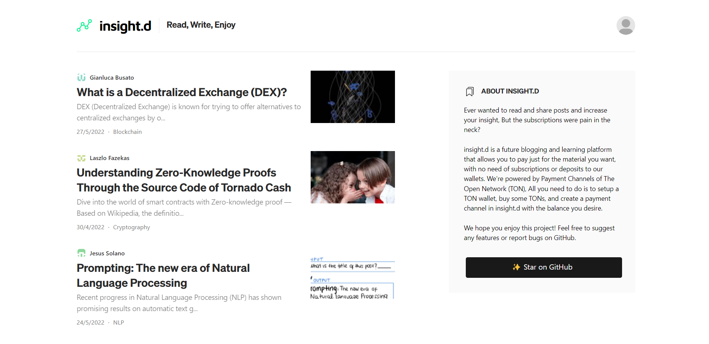

<h3 align="center"></h3>

# insight.d
Ever wanted to read and share posts and increase your insight,
  But the subscriptions were pain in the neck?

  insight.d is a future blogging and learning platform that allows you
  to pay just for the material you want, with no need of subscriptions
  or deposits to our wallets.
  We're powered by Payment Channels of The Open Network (TON),
  All you need to do is to setup a TON wallet, buy some TONs, and
  create a payment channel in insight.d with the balance you desire.
